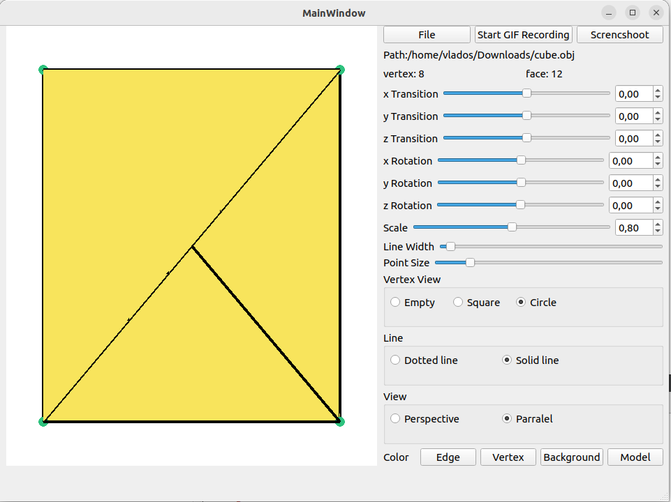

# Мануал по программе 3DViewer

Программа используется для отображения моделей в формате `.obj`, а также обладает функционалом для отображения граней и вершин, изменения цвета модели, создания рендеров модели и создания небольших GIF анимаций.

*Рисунок 1 - Интерфейс программы*

## Описание функционала:

1. **Область отображения модели**
   
2. **Область открытия файла и вывода информации о нем, а также сохранение рендеров и GIF анимаций**

   - Для загрузки модели необходимо нажать на кнопку **"File"**, после чего выбрать в появившемся окне нужную модель.
   - Кнопка **"Screenshot"** сохраняет текущую отображаемую модель в картинку в формате `.jpg` и `.bmp`.
   - Кнопка **"Start recording GIF"** позволяет записать GIF анимацию. Для этого после нажатия на кнопку нужно менять положение, размеры, цвет модели так, как вам нужно, после чего нажать на кнопку **"Save"** для сохранения.
   - В **"Path"** отображается путь до модели.
   - **"Vertex"** показывает количество вершин.
   - **"Face"** показывает количество граней.

3. **Область, в которой можно менять положение, угол отображения и размер модели**

   - Для изменения можно воспользоваться либо ползунком, либо прописать значение вручную.
   - **"Transition"** позволяет менять положение относительно определенной оси.
   - **"Rotation"** позволяет менять угол относительно оси.
   - **"Scale"** позволяет менять размер фигуры целиком.

4. **Область изменения размеров вершин и граней**

   - **"Points size"** изменяет размер вершин.
   - **"Line width"** изменяет размер граней.

5. **Область выбора вида отображения вершин и граней**

   - **"Empty"** — отключить отображение вершин.
   - **"Circle"** — включить отображение вершин в виде круга.
   - **"Square"** — включить отображение вершин в виде квадрата.
   - **"Solid line"** — включить отображение сплошных линий.
   - **"Dotted line"** — включить отображение прерывистых линий.

6. **Область выбора отображения модели**

   - **"Perspective"** — отображение в режиме перспективы.
   - **"Parallel"** — отображение в режиме параллели.

7. **Область выбора цвета**

   - **"Background"** — кнопка выбора цвета заднего фона.
   - **"Edge"** — кнопка выбора цвета граней.
   - **"Model"** — кнопка выбора цвета модели.
   - **"Vertex"** — кнопка выбора цвета вершин.
